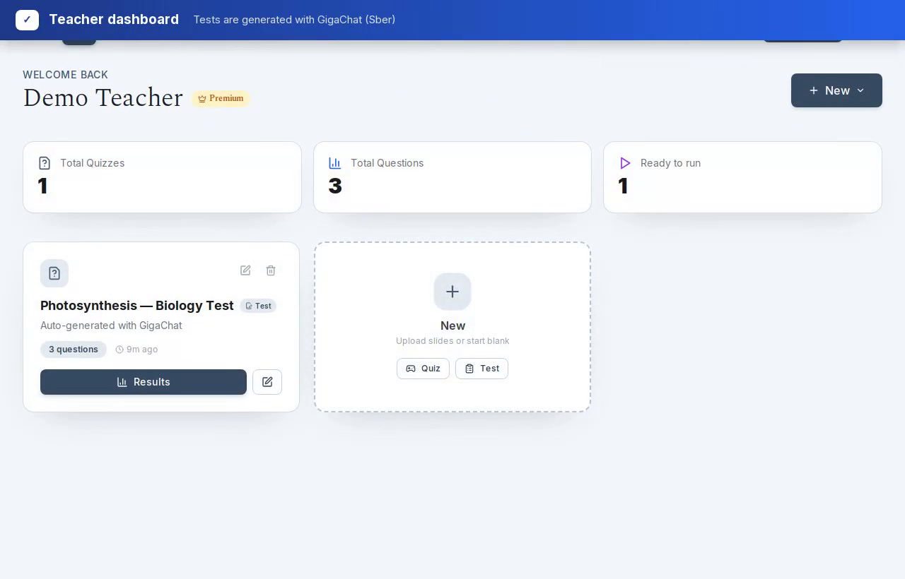
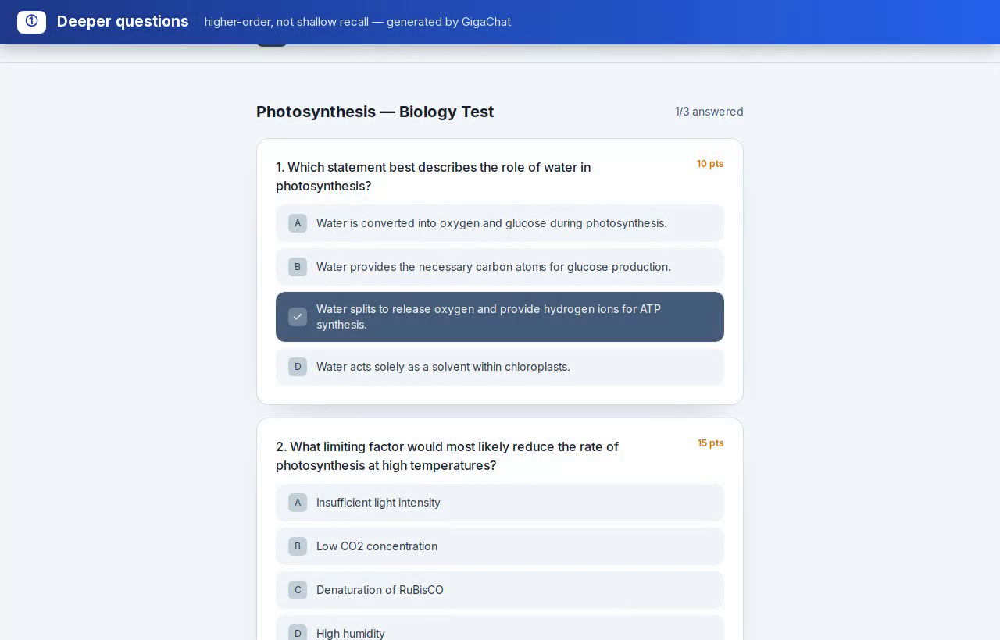
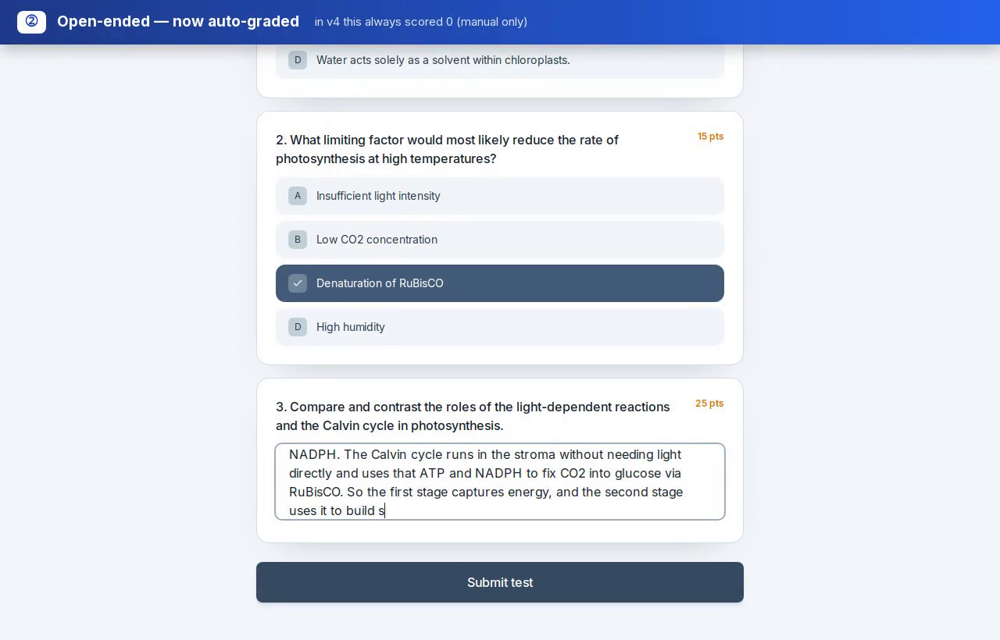
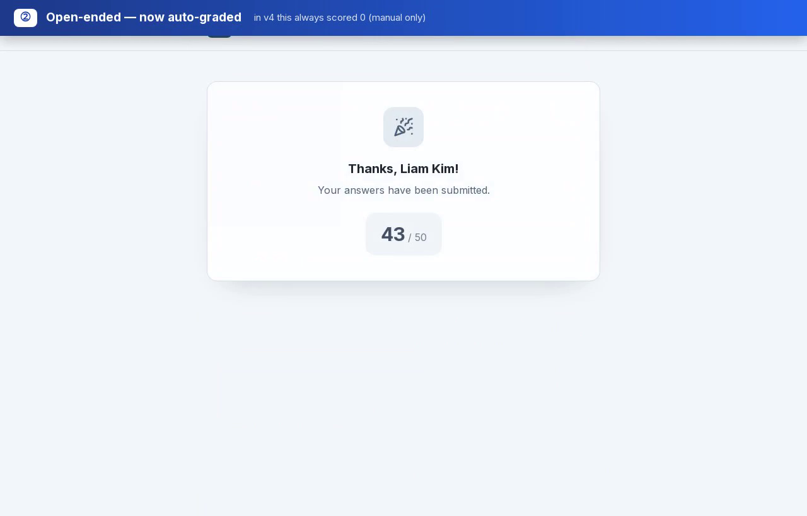

# 🎓 Gradium

**AI-powered quiz & test platform for teachers and students.** A teacher uploads
lecture slides (PDF / PPTX / ODP), the AI turns them into questions, and the class
takes the quiz — live and gamified, or async like a graded form.




---

## ✨ What It Does

- **Quiz mode** — live, Kahoot-style. Students join with a session code, questions
  appear in real time over WebSocket, answers lock in and reveal together, with a
  gamified leaderboard.
- **Test mode** — async, Google-Forms-style. The teacher publishes a link and
  students complete it on their own within an optional time window, including
  open-ended questions that are **auto-graded by the AI**.

**Stack:** FastAPI + SQLAlchemy + SQLite (backend) · Next.js 15 (App Router) +
TypeScript + Tailwind (frontend) · WebSockets for live sessions.

---

## 📸 Screenshots

| AI-generated questions | Open-ended, auto-graded | Instant AI score |
|---|---|---|
|  |  |  |

---

## 🧭 Features

**Creating quizzes & tests**
- **AI generation from slides** — upload PDF/PPTX/ODP and generate multiple-choice
  and open-ended questions grounded in the deck. Generation reliably returns the
  requested number of questions (it tops up short batches and recovers questions
  from truncated model output).
- **Deeper questions** — prompts steer the model away from shallow recall toward
  analysis, application, cause-and-effect, and scenario questions with plausible
  distractors.
- **Topic picker** — see the topics the AI found in a deck and generate questions
  scoped to just the ones you select.
- **Manual editing** — add, edit, delete, or AI-regenerate individual questions.
- **Source attribution** — each generated question shows which slide it came from.
- **PDF export** — printable handout with an optional answer key, full Unicode
  support (e.g. Cyrillic).

**Running with students**
- **Live quiz sessions** — real-time questions, answer stats, reveal control, and a
  final leaderboard, all over WebSocket.
- **Per-student answer shuffling (anti-cheat)** — each student sees options in their
  own deterministic order, so "the answer is C" doesn't travel across the room.
- **Unique names per session** — only the original browser can rejoin under a name.
- **Attendance** — optionally require an email and export a roster as CSV.
- **Async tests** — shareable link, optional open/close window, open-ended answers
  auto-graded against a model answer (graceful fallback to manual grading).
- **Cross-quiz student history** — look up a student and see every quiz and test
  they've taken across all of a teacher's quizzes.

**Extras**
- **PDF & document summarizer** — students can upload a document and get an
  AI-generated study summary (no account needed).

---

## 🤖 AI Providers

Question generation runs through a provider abstraction in
`backend/app/services/ai_service.py`. Choose one with `AI_PROVIDER`:

| Provider | `AI_PROVIDER` | Notes |
|----------|---------------|-------|
| **GigaChat** (Sber) | `gigachat` *(default)* | Text-only; slides are converted to extracted text first. Two-step OAuth handled automatically. |
| Gemini | `gemini` | Reads the PDF visually (no text extraction). |
| DeepSeek | `deepseek` | Text-only (OpenAI-compatible API). |

> ⚠️ DeepSeek's `deepseek-chat` / `deepseek-reasoner` model names are deprecated on
> **2026-07-24** in favor of `deepseek-v4-flash` / `deepseek-v4-pro`. Update
> `DEEPSEEK_MODEL` if you use that provider.

---

## 📁 Project Structure

```
.
├── src/                     # Next.js app (App Router)
│   ├── app/                 # teacher / student / auth / pricing routes
│   ├── components/          # navbar, footer, motion helpers, UI
│   └── lib/                 # api client, utils
├── public/                  # logo & favicon assets
├── docs/                    # screenshots used in this README
├── backend/
│   └── app/
│       ├── api/routes/      # auth, quiz, student, test, teacher, admin, websocket
│       ├── models/          # SQLAlchemy models
│       ├── schemas/         # Pydantic request/response models
│       ├── services/        # ai_service, pdf_service, file_service
│       ├── entitlements.py  # tier limits + generation quota
│       └── promocodes.py    # promo-code generation
├── docker-compose.yml
├── Dockerfile               # frontend (multi-stage Next.js standalone build)
├── .env.example             # copy to .env and fill in — see below
└── SECURITY.md
```

---

## 🔑 Configuration & API Keys

> **No secrets are committed to this repository.** `.env` files are git-ignored;
> only `.env.example` (a template with empty values) is tracked. You must create
> your own `.env` and add at least one AI provider key before generation works.

**1. Copy the template**

```bash
cp .env.example .env          # used by Docker Compose (and the frontend)
cp .env.example backend/.env  # used by the backend when run locally
```

**2. Set a real app secret** (used to sign login tokens):

```bash
# put the output in SECRET_KEY
openssl rand -hex 32
```

**3. Add at least one AI provider key** and point `AI_PROVIDER` at it:

| Provider | Get a key from | Set in `.env` |
|----------|----------------|---------------|
| **GigaChat** (Sber) | [developers.sber.ru → GigaChat API](https://developers.sber.ru/portal/products/gigachat-api) | `AI_PROVIDER=gigachat`, `GIGACHAT_AUTH_KEY=…`, `GIGACHAT_SCOPE=GIGACHAT_API_PERS` |
| **Gemini** | [Google AI Studio](https://aistudio.google.com/app/apikey) | `AI_PROVIDER=gemini`, `GEMINI_API_KEY=…` |
| **DeepSeek** | [platform.deepseek.com](https://platform.deepseek.com/api_keys) | `AI_PROVIDER=deepseek`, `DEEPSEEK_API_KEY=…` |

**All settings**

| Variable | Purpose |
|---|---|
| `AI_PROVIDER` | `gigachat` (default), `gemini`, or `deepseek` |
| `GIGACHAT_AUTH_KEY` / `GIGACHAT_SCOPE` / `GIGACHAT_MODEL` | GigaChat (Sber) config |
| `GIGACHAT_MAX_TOKENS` | Output cap; raise it so large question batches aren't truncated |
| `GEMINI_API_KEY` / `GEMINI_MODEL` | Gemini config |
| `DEEPSEEK_API_KEY` / `DEEPSEEK_MODEL` / `DEEPSEEK_BASE_URL` | DeepSeek config |
| `SECRET_KEY` | JWT signing key — **must** be a random value in production |
| `DATABASE_URL` | SQLite by default |
| `GENERATION_PERIOD` | Quota reset window: `daily`, `weekly`, or `monthly` (default) |
| `FREE_GENERATIONS` / `PRO_GENERATIONS` / `MAX_GENERATIONS` | Per-tier generation limits (3 / 30 / 60) |
| `ADMIN_EMAILS` | Comma-separated emails that can open the admin panel |
| `CORS_ORIGINS` | Allowed frontend origins |
| `NEXT_PUBLIC_API_URL` / `NEXT_PUBLIC_WS_URL` | Browser-facing API/WS URLs (baked into the frontend **at build time**) |

> When deploying behind a public IP or domain, set `NEXT_PUBLIC_API_URL`,
> `NEXT_PUBLIC_WS_URL`, and `CORS_ORIGINS` to that host — the frontend inlines the
> API/WS URLs at build time.

---

## 🚀 Running Locally

**Backend**
```bash
cd backend
python -m venv venv && source venv/bin/activate
pip install -r requirements.txt
cp ../.env.example .env        # then fill in SECRET_KEY + your AI provider key
uvicorn app.main:app --reload --port 8000
```

**Frontend** (works out of the box against `localhost:8000`)
```bash
npm install
npm run dev
```

Or start both at once: `./run-dev.sh` (expects `backend/venv` to already exist).

Frontend → http://localhost:3000 · Backend → http://localhost:8000

## 🐳 Running with Docker

```bash
cp .env.example .env           # fill in SECRET_KEY + at least one AI provider key
docker compose up --build
```

Frontend on `:3000`, backend on `:8000` (override with `FRONTEND_PORT` /
`BACKEND_PORT`). The Compose file ships hardened containers (read-only rootfs,
dropped capabilities, no-new-privileges, resource limits) — see
[`SECURITY.md`](SECURITY.md).

---

## 💳 Subscriptions & Admin

Every logged-in teacher can create quizzes, run live sessions, publish tests, and
add questions manually. Tiers differ **only** by how many AI generations you may run
per period:

| Tier | AI generations / period | Price |
|------|:-----------------------:|-------|
| Free | 3   | $0 |
| Pro  | 30  | $9.99 |
| Max  | 60  | $14.99 |

Payment is handled out-of-band: a buyer contacts the owner for a single-use,
upgrade-only **promo code** and redeems it in-app. Accounts listed in
`ADMIN_EMAILS` get an **Admin** panel at `/teacher/admin` to mint promo codes and
manage subscriptions.

---

## 🔒 Security

- Secrets live only in git-ignored `.env` files — never commit them. Rotate any key
  that has ever been shared or exposed.
- `ENVIRONMENT=production` hides `/docs` and refuses to boot on the default
  `SECRET_KEY`.
- See [`SECURITY.md`](SECURITY.md) for the full deployment hardening notes.

---

## 🏁 Getting Started

1. Register a teacher account. If your email is in `ADMIN_EMAILS`, you'll see an
   **Admin** button on the dashboard.
2. (Admin) Open `/teacher/admin` → **Promo codes** → generate Pro/Max codes.
3. Create a quiz or test, upload slides, and generate questions with AI.
4. Run a live session (share the code) or publish a test (share the link).
5. To lift the AI generation limit, redeem a promo code on the pricing page.
